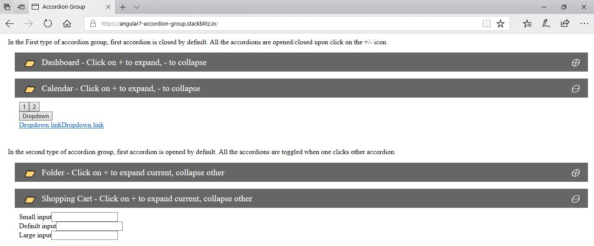
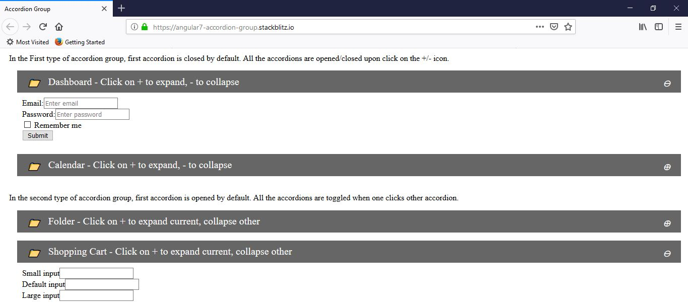
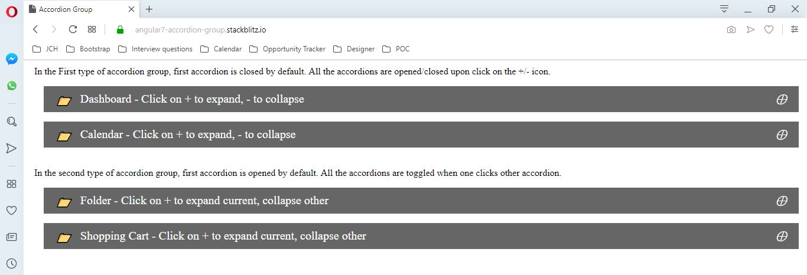

# AccordionGroup

Accordion Group created using Angular 8 to provide collapsible panel utility across different browsers without using any built in library like jquery or bootstrap. Moreover it provides the user to override default html icons using some other libraries like font-awesome.







## Demo

Checkout the demo on StackBlitz - https://angular7-accordion-group.stackblitz.io/

## Adding the component in your project

### Add Components in module
Import
`
import { AccordionGroupComponent } from './components/accordion/accordion-group.component';
import { AccordionComponent } from './components/accordion/accordion.component';
`

Declaration
`
declarations: [
     AccordionGroupComponent,
    AccordionComponent
  ]
`

### Add selector in HTML
```
<app-accordion [openFirst]="openFirst1" [toggle]="toggle1">
 <app-group [title]="title1" [description]="description1" [icon]="icon1" [open]="open1" [close]="close1">
 // form content
 </app-group>
 </app-accordion>
```
### Selector Properties
Property `openFirst`, `toggle` accept boolean values.
Property `title`, `description`, `icon`,`open` and `close` accept string values.

### accordion.component.ts
``` typescript
import { Component, ContentChildren, QueryList, AfterContentInit, Input, OnInit } from '@angular/core';
import { AccordionGroupComponent } from './accordion-group.component';

@Component({
  selector: 'app-accordion',
  templateUrl: 'accordion.component.html',
  styleUrls: ['./accordion.component.css']
})

export class AccordionComponent  implements OnInit, AfterContentInit {
  @ContentChildren(AccordionGroupComponent)
  groups: QueryList<AccordionGroupComponent>;

  @Input() title: any;

  @Input() icon: any;

  @Input() openFirst: boolean;

  @Input() toggle: boolean;

  ngOnInit() {
  }
  /**
   * Invoked when all children (groups) are ready
   */
  ngAfterContentInit() {
    // Set active to first element
    if (this.openFirst) {
      this.groups.toArray()[0].opened = true;
    }
    // Loop through all Groups
    this.groups.toArray().forEach((t) => {
      // when title bar is clicked
      // (toggle is an @output event of Group)
      t.toggle.subscribe(() => {
        // Open the group
        this.openGroup(t);
      });
    });
  }

  /**
   * Open an accordion group
   * @param group   Group instance
   */
  openGroup(group) {
    if (this.toggle) {
      // close other groups
      this.groups.toArray().forEach((t) => {
        if (t !== group) {
        t.opened = false;
        }
      });
    }
    // open current group
    group.opened = !group.opened;
  }
}

```

### accordion.component.html
``` html
<ng-content></ng-content>
```

### accordion.component.css
``` css
 .accordionPanel {
     margin:1em;
 }
  .accordionPanel .titleBar {
    background-color: rgba(102, 102, 102, 1);
    color:white;
    width: 100%;
    padding: 10px;
    cursor: pointer;
    border-bottom: 1px solid #666;
  }

  .accordionPanel .title {
      margin:5px;
      font-size:20px;
  }
  
  .accordionPanel .body {
    padding: 10px;
  }
  
  .accordionPanel .body.hidden {
    display: none;
  }

  .expandCollapseIcon {
      float:right;
      font-size:20px;
      margin: 0px 10px;  
  }

  .headerIcon {
      float:left;
      font-size:20px;
      margin:0px 10px;
  }

  .open::after {
    content: "\2295";
  }

  .close::after {
    content: "\2296";
  }

  .icon::after {
    content: "\1F4C1";
  }
```
### accordion-group.component.ts
``` typescript
import { Component, Input, Output, EventEmitter, OnInit } from '@angular/core';

@Component({
  selector: 'app-group',
  templateUrl: 'accordion-group.component.html',
  styleUrls: ['accordion.component.css']
})
export class AccordionGroupComponent implements OnInit{

  /**
   * If the panel is opened or closed
   */
  @Input() opened = false;

  /**
   * Text to display in the group title bar
   */
  @Input() title: string;

  @Input() description; string;

  @Input() icon: string;

  @Input() open: any;

  @Input() close: any;
  /**
   * Emitted when user clicks on group titlebar
   */
  @Output() toggle: EventEmitter<any> = new EventEmitter<any>();

  ngOnInit() {
    if (!this.open) {
      this.open = 'open';
    }
    if (!this.close) {
      this.close = 'close';
    }
    if (!this.icon) {
      this.icon = 'icon';
    }
  }
}


```
### accordion-group.component.html

``` html
<div class="accordionPanel">
    <div class="titleBar" (click)="toggle.emit()">
    <span class="headerIcon"><i [ngClass]="[icon]"></i></span>
    <span class="title">{{title}} - {{description}}</span>
    <span class="expandCollapseIcon"><i [ngClass]="opened?[close]:[open]"></i></span>
    </div>
    <div class="body" [ngClass]="{'hidden': !opened}">
      <ng-content></ng-content>
    </div>
  <div>

```
## Author

parasmani.jain2208@gmail.com

